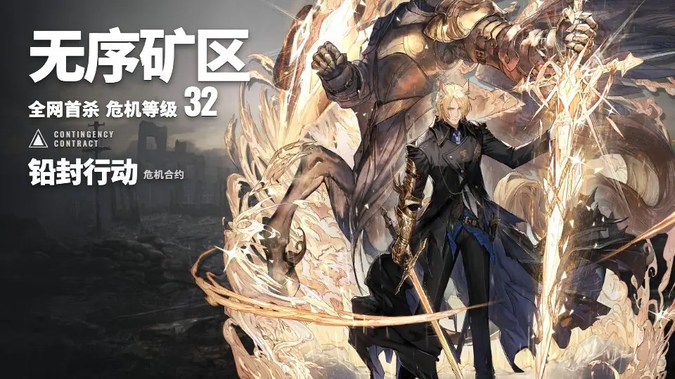
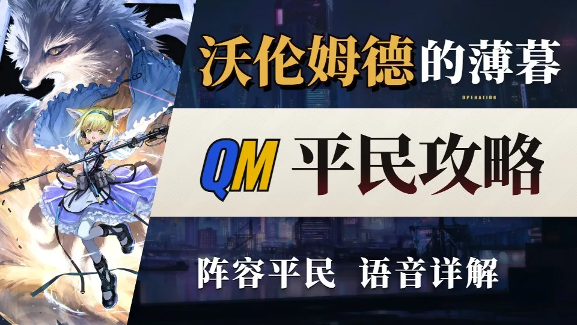
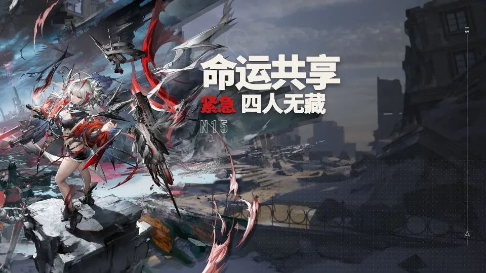
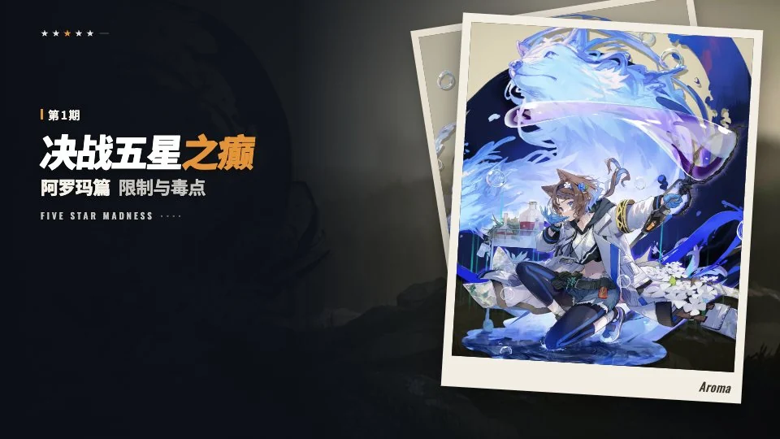
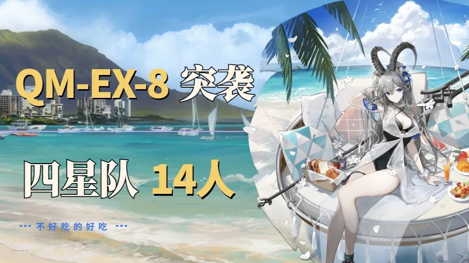
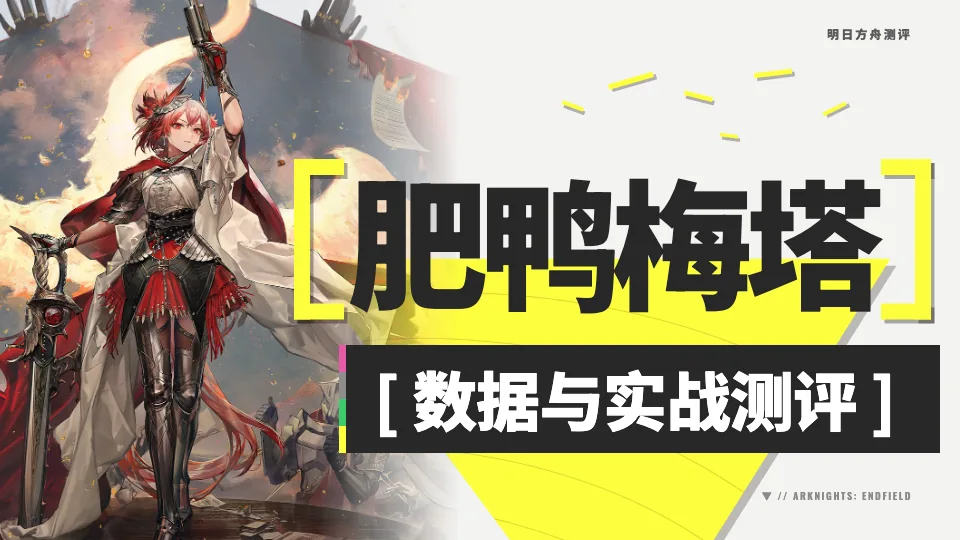
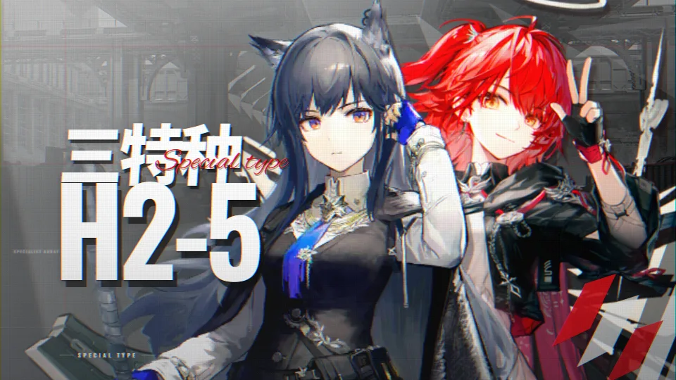
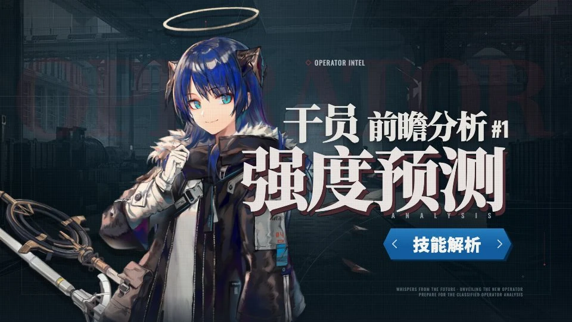
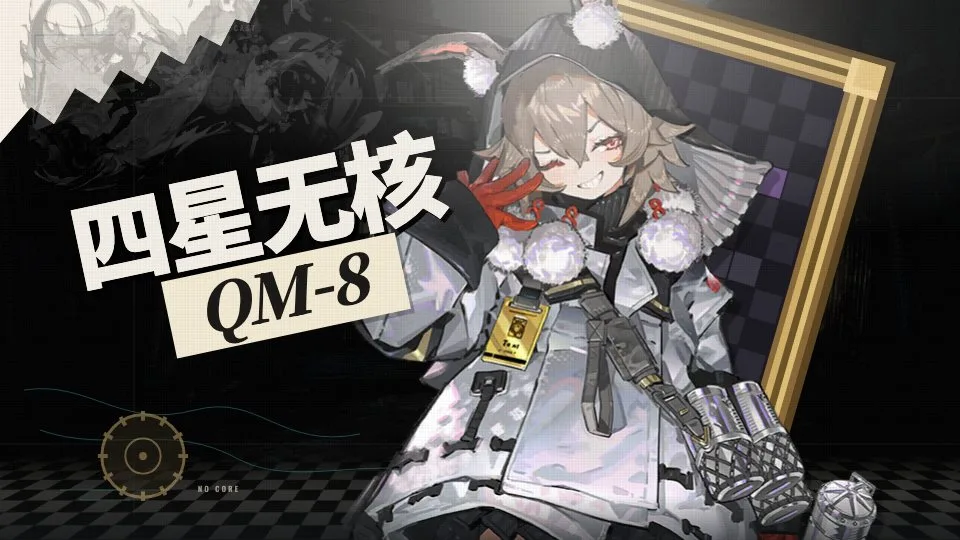
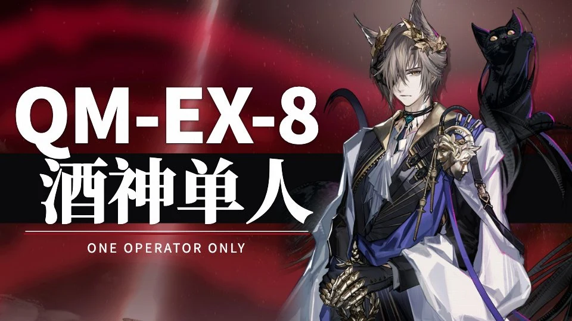

# QMcover

明日方舟 B 站横版封面工坊。首页选模板，进编辑器改字、点立绘、换背景，导出 **1920×1080 PNG**。

纯前端，草稿存在浏览器 `localStorage`，不接后端。

技术栈：React 19 + Vite + TypeScript + Tailwind CSS 4。

| 危机合约 | 低配攻略 | 肉鸽 | 决战五星之癫 | 无核论文 | 终末地角色测评 | 职业队 | 干员前瞻分析 | 四星无核 | 仅需一人 |
| --- | --- | --- | --- | --- | --- | --- | --- | --- | --- |
|  |  |  |  |  |  |  |  |  |  |

相关文档：

- [如何加模板](TEMPLATES.md)
- [按参考图做新模板](doc/模仿参考图生成模板.md)
- [危机合约构图参考](references/crisis-contract/INDEX.md)
- [肉鸽构图参考](references/rogue/INDEX.md)
- [无核论文构图参考](references/kirby/INDEX.md)
- [终末地测评构图参考](references/endfield-review/INDEX.md)
- [莱茵实验组特种队构图参考](references/secret-plan/INDEX.md)
- [干员前瞻构图参考](references/operator-preview/INDEX.md)
- [四星无核首杀构图参考](references/fourstar-nocore/INDEX.md)
- [仅需一人构图参考](references/solo-clear/INDEX.md)

## 本地运行

```bash
npm install
npm run dev
```

本机看效果可以打开终端提示的地址（默认 `http://localhost:5173/`）。AI 改 UI 的验收走 Playwright **Chromium**（`npm test`），不要用 Edge。

| 命令 | 作用 |
| --- | --- |
| `npm run dev` | 开发服务 |
| `npm run build` | 类型检查 + 生产构建 |
| `npm run preview` | 预览构建结果 |
| `npm run lint` | oxlint |
| `npm test` | 无头 Chromium 跑浏览器测试 |
| `npm run test:browser` | 有窗口跑浏览器测试 |
| `npm run playwright:install` | 安装测试用 Chromium |
| `npm run operators` | 从游戏表重建干员目录 |

## 使用

1. 首页点一张模板，进入 `#/t/<模板id>`。
2. 右侧改地图 / 标题、副标题、危机等级或期数、行动名或署名。
3. 左侧点图层，或直接点画布上的字，可改位置、字体、字号、颜色。选中后也可拖动。
4. 立绘库按职业筛选，点干员再点立绘。库里没有的皮肤可上传。
5. 危机合约、低配攻略、无核论文模板可换 AVG 场景底。
6. 拖动立绘调位置，滑条调缩放。安全区勾选后显示 B 站裁切提示框，不进导出。
7. **新建**会清空当前模板草稿（先确认）。**导出封面**下载 PNG。

每个模板各自存一份草稿，互不影响。

## 模板

首页列出 `src/data/templates.ts`。当前十套：

| id | 名称 | 构图 |
| --- | --- | --- |
| `firstkill` | 危机合约模板 | 参考铅封行动类封面：左上地图名，副标题 + 危机等级 + 数字一行，三角标 + `CONTINGENCY CONTRACT`，下面行动名 +「危机合约」。右侧干员。 |
| `lowspec` | 低配攻略 | 参考 ZC 活动关封面：左立绘斜切，右三横条。上「活动 + 行动名」，中纸色条「署名 + 攻略类型」，下「阵容平民 语音详解」。 |
| `rogue` | 肉鸽模板 | 参考 Mujica 命运共享封面：左立绘，右宋体主题加红划痕，上下空心 ISW-NO，红字紧急 + 白条件。 |
| `madness` | 决战五星之癫 | 参考五星测评类封面：左暗底栏目名 + 期数 + 干员篇，右拍立得立绘。栏目名固定为「决战五星之癫」。 |
| `nocore` | 无核论文 | 参考小鬼卡比 SN-EX-8：暗底，左两行金白大字，一条紫线，右立绘。 |
| `endfield` | 终末地角色测评 | 参考血狼破军「终末地测评」洁尔佩塔封面：左立绘，右柠黄括号角色名，黑条「数据与实战测评」，浅底黄三角。 |
| `specialist` | 职业队 | 参考日常关卡封面：左超大号阵容+关卡码，红花体斜叠，双立绘近景，工业底加光柱和后期。 |
| `operator-preview` | 干员前瞻分析 | 冷蓝战术底：左立绘，右「干员 + 前瞻分析 + 期数」，白色宋体主标题和蓝色解析条。 |
| `fourstar-nocore` | 四星无核 | 暗底拼贴：左斜抬黑体主标题 + 米色关卡条，右立绘，身后几何金框。 |
| `solo` | 仅需一人 | 暗红氛围：左上关卡码 + 宋体「××单人」+ 白线英文标，右半身立绘。 |

首页卡片用 `public/thumbs/<id>.webp`，不现场渲染 1920 封面、不拉全尺寸立绘。改完构图后打开 `#/__thumb/<id>` 重新导出预览。

`firstkill`、`lowspec`、`rogue`、`madness`、`nocore`、`endfield`、`specialist`、`operator-preview`、`fourstar-nocore`、`solo` 这些 id 不要改：路由和已存草稿都靠它。

### 危机合约

- 地图（如无序矿区）
- 副标题（默认「全网首杀」）
- 危机等级（默认 32）
- 行动名（如铅封行动）
- 背景预设（默认矿坑）
- 默认立绘：雷蛇超载

### 低配攻略

- 活动名（如沃伦姆德的薄暮；含「的」时前半金字、后半白字）
- 副标题（默认「平民攻略」，也可改成全能攻略）
- 署名（短字母会按蓝黄交错上色）
- 背景预设铺进右栏上下条（默认雷云），中栏仍是纸色
- 默认立绘：铃兰精二

底部「阵容平民 语音详解」是这套构图的固定卖点句，不进编辑栏。

### 肉鸽

- 主题（如命运共享，思源宋体，带红划痕）
- 条件（默认「四人无藏」）
- 节点（默认 15，画面显示小字 N15）
- 红标（默认「紧急」，留空则不显示）
- 画布背景（默认 23 G07，可蒙黑）和字背景（默认 fall back）分开选
- 默认立绘：贝洛内精二

### 决战五星之癫

- 干员（点选立绘后自动填，画面显示「阿罗玛篇」）
- 副标题（默认「限制与毒点」）
- 期数（画面显示第 1 期）
- 英文标（默认 FIVE STAR MADNESS，留空也显示这句）
- 背景预设（默认荒野）
- 默认立绘：阿罗玛精二

栏目名「决战五星之癫」和拍立得英文名（从干员表取）是构图固定件，英文名随干员变。

### 无核论文

- 关卡（如 SN-EX-8 突袭；关卡号金色，后面的字白色）
- 限制（默认「三星队 首杀」：空格前白色，后面金色）
- 署名（默认 QM，淡紫，左右三点）
- 背景默认伊比利亚夜海岸，压一层暗纱
- 默认立绘：缄默德克萨斯精二

### 终末地角色测评

- 角色名（默认肥鸭梅塔；点立绘不覆盖，方便写终末地干员名）
- 栏目名（默认「数据与实战测评」）
- 角标（默认「明日方舟测评」）
- 游戏标（默认 ARKNIGHTS: ENDFIELD，右下小字）
- 默认浅纸底 + 黄三角；可选 AVG 只铺在立绘左侧
- 默认立绘：菲亚梅塔「至圣誓言」（浅底上要能看清；终末地立绘请本地上传）

栏目名和柠黄括号是这套构图的固定件。不搬终末地官方标和参考 UP logo。

### 职业队

- 阵容（默认「五特种」）
- 关卡（默认 H15-4，Oswald 超粗挤字）
- 花体标（默认 Special type，Great Vibes 斜叠在阵容上）
- 小标（默认 SPECIAL TYPE，留空则不显示）
- 背景预设（默认军械厂）；默认开光柱、暗角和底图调色
- 默认立绘：前缄默德克萨斯精零，后新约能天使精零（精二特效会挡住后面的人）
- 工作台可调扫描线、颗粒、色散等后期；导出时去掉预览缩放

构图主参考：`references/secret-plan/01_BV1TjbDz1Ejx.jpg`。不搬莱茵组标和封面署名。

### 干员前瞻分析

- 主标题（默认「强度预测」，按字数自动缩放）
- 蓝条文字（默认「技能解析」）
- 分析期数（默认 1，画面显示 `#1`）
- 英文水印（默认 OPERATOR）
- 顶部小标（默认 OPERATOR INTEL）
- 背景预设（默认军工厂）和局部暗角
- 默认立绘：莫斯提马精英 0

构图主参考：`references/operator-preview/01_BV1PWtJ6iEzk.jpg`。只复刻构图骨架，不搬原作者系列标识。

### 四星无核

- 主标题（默认「四星无核」，按字数缩放，斜抬黑体）
- 关卡（默认 QM-8，坐在米色梯形条上）
- 英文小字（默认 NO CORE）
- 暗底拼贴：棋盘格、青绿线框、几何提线偶、斜金框
- 默认立绘：跃跃精英 0（精二特效会盖住拼贴底）
- 金框里是几何地块，不搬参考图的实机截图

构图主参考：`references/fourstar-nocore/01_BV1qipFzMEDS.jpg`。不搬整张封面、署名和框内录像。和「无核论文」不是同一套构图。

### 仅需一人

- 关卡码（默认 QM-EX-8，超大号无衬线）
- 主标题（默认「酒神单人」，宋体黑，压在黑条上）
- 英文标（默认 ONE OPERATOR ONLY，跟在细白线下）
- 红雾（可关、可调透明度）
- 默认立绘：酒神精英 0（精二立绘自带场景，会冲掉暗红底）
- 默认背景：哥伦比亚场景 38_g17_1 + 红雾（透明度 74）

构图主参考：`references/solo-clear/01_BV1awbAzSERP.jpg`。不搬整张封面和署名。

编辑器不展示日期；`draft.date` 只用于导出文件名。

## 目录

```
src/
  App.tsx                 路由：首页 / 工作台
  types.ts                Draft、模板 id、渲染 props
  constants.ts            封面尺寸、安全区、storage key
  data/
    templates.ts          模板元数据
    elements.ts           可编辑图层
    backgrounds.ts        AVG 背景预设
    arts.ts               立绘 / 头像 CDN
    operators.json        干员目录（脚本生成）
  templates/              各模板画面
    registry.tsx          id → 组件
    FirstKill.tsx         危机合约
    LowSpec.tsx           低配攻略
    Rogue.tsx             肉鸽
    Madness.tsx           决战五星之癫
    Nocore.tsx            无核论文
    Endfield.tsx          终末地角色测评
    Specialist.tsx        职业队
    OperatorPreview.tsx   干员前瞻分析
    FourstarNocore.tsx    四星无核
    Solo.tsx              仅需一人
    OperatorLayer.tsx     可拖动立绘
  components/             首页、顶栏、画布、图层面板、编辑栏、立绘库
  store/CoverContext.tsx  当前草稿
  lib/
    thumbs.ts             首页预览图路径
    storage.ts            localStorage
    exportCover.ts        html-to-image 导出
    interpolate.ts        展示用标题
scripts/
  build-operators.mjs     拉 character / skin 表，写 operators.json
  collect-cc-covers.py    重新收集构图参考图（不进 git）
  collect-endfield-review-covers.py  终末地测评封面
references/crisis-contract/   构图参考，jpg 不提交
references/rogue/             肉鸽构图参考，jpg 不提交
references/kirby/             无核论文构图参考，jpg 不提交
references/endfield-review/   终末地测评构图参考，jpg 不提交
references/secret-plan/        莱茵实验组特种队构图参考，jpg 不提交
references/operator-preview/   干员前瞻构图参考，jpg 不提交
references/fourstar-nocore/    四星无核首杀构图参考，jpg 不提交
references/solo-clear/         仅需一人构图参考，jpg 不提交
```

路由是 hash：`#/` 首页，`#/t/firstkill` 打开对应模板。

## 资源

游戏立绘和场景图都是鹰角的，**只在线引用，不进仓库**。导出时图片带 `crossOrigin="anonymous"`，方便 `html-to-image` 打成一张图。

### 干员立绘

来自 [yuanyan3060/ArknightsGameResource](https://github.com/yuanyan3060/ArknightsGameResource)，jsDelivr：

- 立绘：`…/skin/<portraitId>b.png`
- 头像：`…/avatar/<charId>.png`

目录 `src/data/operators.json` 由 `npm run operators` 从同仓库的 `character_table.json`、`skin_table.json` 生成。游戏出新干员或皮肤后跑一次。库里没有的图可以本地上传。

### 危机合约背景

来自 [Aceship/Arknight-Images](https://github.com/Aceship/Arknight-Images) 的 `avg/backgrounds`。预设写在 `src/data/backgrounds.ts`，目前是墨底 + 25 张外景。场景按原色铺满，左边留一层浅渐变保证字可读。

不要拿别人的 B 站封面或官方宣传图当整张模板底。`references/` 里的图只作构图参考，已被 gitignore。

## 数据与导出

- 存储键：`qmcover-v3`（`src/constants.ts` 的 `STORAGE_KEY`）。
- 结构：`{ drafts: { [templateId]: Draft } }`。图层的位置 / 字体 / 字号 / 颜色存在 `draft.elementStyles`。
- 导出：`html-to-image` 的 `toPng`，固定 1920×1080。带 `data-ignore-export="true"` 的节点（安全区）会被滤掉。
- 文件名：`日期_模板名_干员.png`。

画布按 16:9 缩放预览，导出仍是 1920×1080。安全区大约避开卡片裁切、右下时长角标和底部标题叠字。

## 扩展

### 加模板

见 [TEMPLATES.md](TEMPLATES.md)。四步：`TemplateId` → 新建 `src/templates/Xxx.tsx` → `registry.tsx` → `templates.ts`。复刻的是构图，不是别人的整张封面。

### 加 AVG 背景

在 `src/data/backgrounds.ts` 的 `BG_PRESETS` 加一条 `id` / `name` / `url`。文件名对照 Aceship 仓库 `avg/backgrounds/`。墨底 `url` 为 `null`。

已选中的旧 id（例如已删除的关卡图）会回退到墨底。

### 改各模板画面

| 模板 | 文件 | 注意 |
| --- | --- | --- |
| 危机合约 | `src/templates/FirstKill.tsx` | 字号会按地图名、行动名长度缩小，避免溢出。 |
| 低配攻略 | `src/templates/LowSpec.tsx` | 复刻左立绘 + 白底条，不要整图搬参考封面。 |
| 肉鸽 | `src/templates/Rogue.tsx` | 复刻左立绘 + 右宋体主题 + 空心 ISW-NO，不要整图搬参考封面。 |
| 决战五星之癫 | `src/templates/Madness.tsx` | 复刻左文右拍立得，不要整图搬参考封面。 |
| 终末地角色测评 | `src/templates/Endfield.tsx` | 复刻左立绘 + 黄括号名 + 黑条栏目，不要搬官方标和参考 UP logo。 |
| 职业队 | `src/templates/Specialist.tsx` | 复刻左两行粗字 + 红花体 + 右立绘，不要搬组标和封面署名。 |
| 干员前瞻分析 | `src/templates/OperatorPreview.tsx` | 复刻左立绘 + 右宋体大字 + 蓝色栏目条，不要搬原作者系列标识。 |
| 四星无核 | `src/templates/FourstarNocore.tsx` | 复刻左斜抬标题 + 米色关卡条 + 右立绘金框，不要搬整图和实机截图。 |
| 仅需一人 | `src/templates/Solo.tsx` | 复刻左字组 + 暗红氛围 + 右立绘，不要搬整图和署名。 |

## 约定

- 不把官方立绘、AVG、关卡图、别人封面提交进 git。
- 不把 `references/` 下的参考 jpg 提交进 git。
- 不要用渐变色块冒充合约氛围图；场景底用游戏 AVG。
- 立绘显示不要等预加载完成再挂 ``，否则会卡在「立绘载入中」。
- `firstkill` / `lowspec` / `rogue` / `madness` / `nocore` / `endfield` / `specialist` / `operator-preview` / `fourstar-nocore` / `solo` 这些模板 id 保持稳定，改名只改 `name` 字段。
